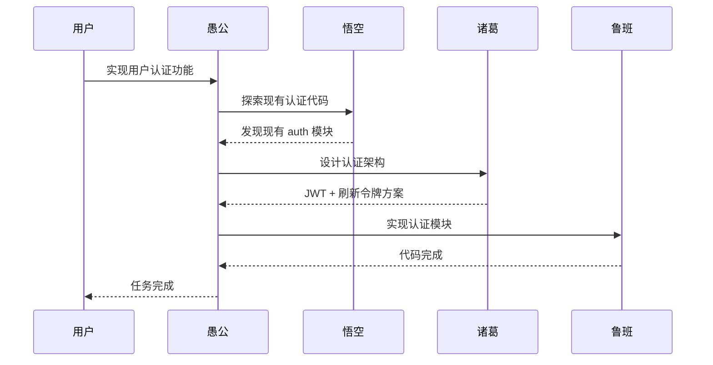
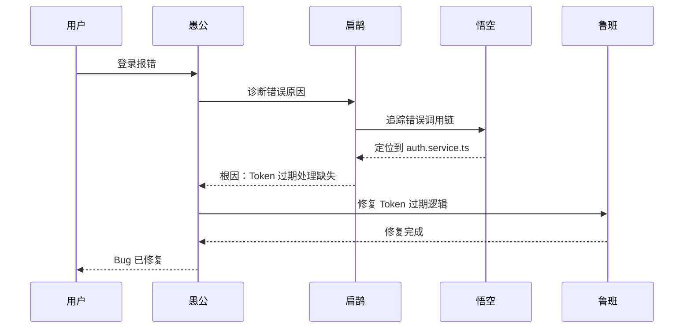

# Agent 协作协议 / Agent Collaboration Protocol

本文档定义了 oh-my-claude 中各 Agent 之间的协作方式和通信规范。

This document defines the collaboration patterns and communication protocols between agents in oh-my-claude.

## Agent 职责矩阵 / Agent Responsibility Matrix

```
┌─────────────────────────────────────────────────────────────────┐
│                        愚公 (YuGong)                             │
│                    主编排 / Main Orchestrator                    │
│         负责任务分解、进度追踪、协调其他 Agent                     │
└─────────────────────────────────────────────────────────────────┘
                              │
          ┌───────────────────┼───────────────────┐
          │                   │                   │
          ▼                   ▼                   ▼
┌─────────────────┐ ┌─────────────────┐ ┌─────────────────┐
│  诸葛 (ZhuGe)   │ │  悟空 (WuKong)  │ │  扁鹊 (BianQue) │
│   战略顾问      │ │   代码侦察      │ │   Bug 诊断      │
│  Strategy       │ │  Scout          │ │  Diagnostics    │
└────────┬────────┘ └────────┬────────┘ └────────┬────────┘
         │                   │                   │
         │                   ▼                   │
         │          ┌─────────────────┐          │
         └─────────►│  鲁班 (LuBan)   │◄─────────┘
                    │   精工巧匠      │
                    │  Implementation │
                    └─────────────────┘
```

## 协作模式 / Collaboration Patterns

### 1. 任务委派模式 / Task Delegation

愚公作为主编排者，可以将任务委派给其他 Agent：

```
愚公 ──[需要架构设计]──► 诸葛
愚公 ──[需要代码探索]──► 悟空
愚公 ──[需要问题诊断]──► 扁鹊
愚公 ──[需要代码实现]──► 鲁班
```

### 2. 信息流动模式 / Information Flow

```
悟空 ──[探索结果]──► 诸葛 ──[设计方案]──► 鲁班
扁鹊 ──[诊断报告]──► 鲁班 ──[修复代码]──► 愚公(验证)
```

### 3. 协作场景示例 / Collaboration Examples

#### 场景一：新功能开发



#### 场景二：Bug 修复



## Agent 通信接口 / Agent Communication Interface

### 任务请求格式 / Task Request Format

```typescript
interface AgentTaskRequest {
  from: AgentName;        // 发起者
  to: AgentName;          // 目标 Agent
  type: TaskType;         // 任务类型
  context: string;        // 上下文信息
  requirements: string[]; // 具体要求
  priority: Priority;     // 优先级
}

type AgentName = 'yugong' | 'zhuge' | 'luban' | 'wukong' | 'bianque';
type TaskType = 'explore' | 'design' | 'implement' | 'diagnose' | 'review';
type Priority = 'high' | 'medium' | 'low';
```

### 任务响应格式 / Task Response Format

```typescript
interface AgentTaskResponse {
  from: AgentName;
  status: 'success' | 'partial' | 'failed';
  result: string;
  artifacts?: string[];   // 产出物（文件路径等）
  suggestions?: string[]; // 后续建议
  blockers?: string[];    // 遇到的阻碍
}
```

## 协作原则 / Collaboration Principles

### 1. 单一职责 / Single Responsibility

每个 Agent 专注于自己的领域：

| Agent | 核心职责 | 不应处理 |
|-------|----------|----------|
| 愚公 | 任务编排、进度追踪 | 具体实现细节 |
| 诸葛 | 架构设计、技术决策 | 代码编写 |
| 鲁班 | 代码实现、质量优化 | 架构决策 |
| 悟空 | 代码探索、信息收集 | 代码修改 |
| 扁鹊 | 问题诊断、根因分析 | 架构重构 |

### 2. 信息透明 / Information Transparency

- 所有 Agent 的工作结果对其他 Agent 可见
- 使用 TodoWrite 记录任务状态
- 关键决策要有文档记录

### 3. 渐进式交付 / Incremental Delivery

- 大任务分解为小步骤
- 每完成一步就更新进度
- 遇到阻碍及时反馈

## 扩展新 Agent / Adding New Agents

如需添加新的 Agent，请遵循以下步骤：

1. **定义角色**：明确新 Agent 的职责和专长
2. **确定协作关系**：如何与现有 Agent 配合
3. **创建 Agent 文件**：在 `agents/` 目录创建配置
4. **创建命令文件**：在 `commands/` 目录创建触发命令
5. **更新文档**：更新本协议和 README

### Agent 定义模板

```markdown
---
name: new-agent
description: |
  新 Agent 描述...
allowed-tools:
  - Read
  - Grep
  - Glob
  # 根据需要添加
model: sonnet  # 或 opus
---

# Agent 名称

Agent 详细说明...
```

## 版本历史 / Version History

| 版本 | 日期 | 变更 |
|------|------|------|
| 0.1.0 | 2025-01 | 初始版本，定义 5 个核心 Agent 的协作模式 |

---

> **注**：本协议会随着项目发展持续更新。欢迎通过 Issue 或 PR 提出改进建议。
