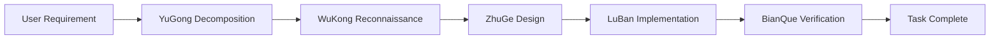
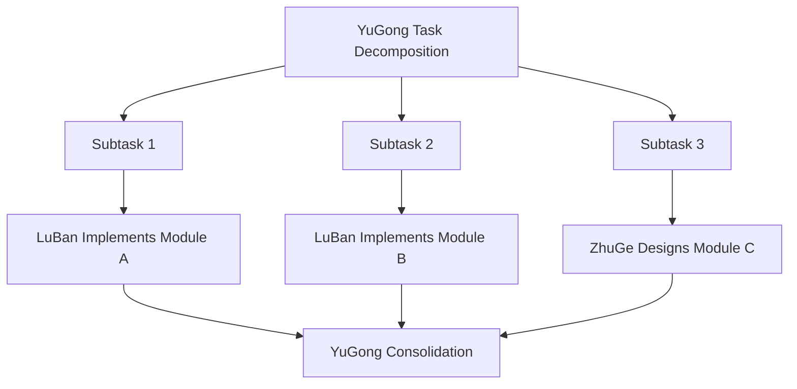
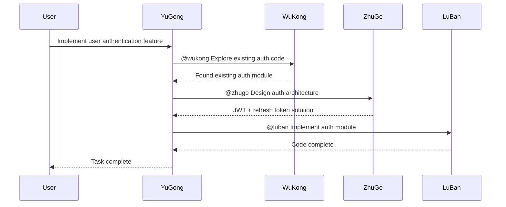
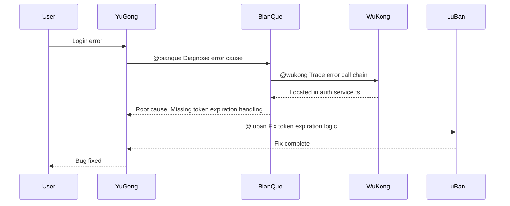

# Agent Collaboration Protocol

This document defines the collaboration patterns and communication protocols between agents in oh-my-claude.

## Agent Responsibility Matrix

### Core Architecture

```
┌─────────────────────────────────────────────────────────────────┐
│                        YuGong (愚公)                             │
│                    Main Orchestrator                             │
│         Responsible for task decomposition, progress tracking,   │
│         and coordinating other Agents                            │
└─────────────────────────────────────────────────────────────────┘
                              │
          ┌───────────────────┼───────────────────┐
          │                   │                   │
          ▼                   ▼                   ▼
┌─────────────────┐ ┌─────────────────┐ ┌─────────────────┐
│  ZhuGe (诸葛)   │ │  WuKong (悟空)  │ │  BianQue (扁鹊) │
│  Strategy       │ │  Scout          │ │  Diagnostics    │
│  Advisor        │ │  Code Recon     │ │  Bug Diagnosis  │
└────────┬────────┘ └────────┬────────┘ └────────┬────────┘
         │                   │                   │
         │                   ▼                   │
         │          ┌─────────────────┐          │
         └─────────►│  LuBan (鲁班)   │◄─────────┘
                    │  Master Artisan │
                    │  Implementation │
                    └─────────────────┘
```

### Complete Agent List

| Agent | Name | Expertise | Commands |
|-------|------|-----------|----------|
| 🏔️ | **YuGong** (愚公) | Main orchestration, large-scale tasks | `/yugong` `/yishan` |
| 🎯 | **ZhuGe** (诸葛) | Strategy advisor, architecture design | `/zhuge` `/longzhong` |
| 🔧 | **LuBan** (鲁班) | Master artisan, code implementation | `/luban` `/qiaogong` |
| 🔍 | **WuKong** (悟空) | Code reconnaissance, rapid exploration | `/wukong` `/huoyan` |
| 🩺 | **BianQue** (扁鹊) | Bug diagnosis, problem fixing | `/bianque` `/wangwen` |
| 🛡️ | **MoZi** (墨子) | Security audit, defensive programming | `/mozi` `/security` |
| ⚔️ | **SunZi** (孙子) | Performance optimization, system tuning | `/sunzi` `/perf` |
| 📜 | **SimaQian** (司马迁) | Documentation, changelog | `/simaqian` `/doc` |
| ⛵ | **ZhengHe** (郑和) | API integration, external services | `/zhenghe` `/api` |
| 🔭 | **ZhangHeng** (张衡) | System monitoring, observability | `/zhangheng` `/monitor` |
| 🌊 | **LiBing** (李冰) | DevOps, infrastructure | `/libing` `/devops` |
| ☯️ | **LaoZi** (老子) | Code simplification, Clean Code | `/laozi` `/simplify` |
| ⚖️ | **BaoZheng** (包拯) | Testing expert, TDD | `/baozheng` `/test` |
| 🪞 | **WeiZheng** (魏征) | Code review, standards checking | `/weizheng` `/review` |
| 📊 | **CangJie** (仓颉) | Database design, SQL optimization | `/cangjie` `/db` |
| ✨ | **LiBai** (李白) | Requirements analysis, user stories | `/libai` `/poet` |
| 🎨 | **GuKaiZhi** (顾恺之) | UI/UX design, interface aesthetics | `/gukaizhi` `/painter` |
| 🌙 | **ChangE** (嫦娥) | Cloud services, Serverless deployment | `/change` `/cloud` |

## 🔗 Agent Invocation Syntax

### Explicit Invocation

During any Agent's work, other Agents can be invoked using the following syntax:

```markdown
@agent_name [task description]
```

**Invocation Examples:**

```markdown
@wukong Explore all code files related to user authentication
@zhuge Analyze the scalability issues of the current architecture
@luban Implement the getProfile method of UserService
@bianque Diagnose this TypeError: Cannot read property 'name' of undefined
@yugong Coordinate the complete refactoring of the user module
```

### Invocation Response Format

The invoked Agent should respond in the following format:

```markdown
---
【Agent Name】Task Accepted
---

[Task execution process and results]

---
【Agent Name】Task Complete ✅
Returning control to @caller_agent
---
```

## Collaboration Patterns

### 1. Task Delegation Pattern

YuGong as the main orchestrator can delegate tasks to other Agents:

```
YuGong ──[needs architecture design]──► ZhuGe
YuGong ──[needs code exploration]──► WuKong
YuGong ──[needs problem diagnosis]──► BianQue
YuGong ──[needs code implementation]──► LuBan
```

### 2. Information Flow Pattern

```
WuKong ──[exploration results]──► ZhuGe ──[design proposal]──► LuBan
BianQue ──[diagnosis report]──► LuBan ──[fix code]──► YuGong(verification)
```

### 3. Chain Collaboration

Multiple Agents collaborate in sequence to complete complex tasks:



### 4. Parallel Collaboration

Multiple Agents execute independent subtasks simultaneously:



## Collaboration Scenario Examples

### Scenario 1: New Feature Development



**Practical Interaction Example:**

```markdown
【YuGong Starting Task】
User needs to implement user authentication feature. I will decompose the task and coordinate experts.

First, I need to understand the existing codebase:
@wukong Explore all code related to user authentication, including:
- Existing auth directory structure
- Existing user models
- Related middleware
```

```markdown
---
【WuKong】Task Accepted
---

🔍 Starting exploration of authentication-related code...

### Discovery Results

**Related Files:**
- `src/auth/` - Authentication module directory
- `src/models/User.ts` - User model
- `src/middleware/authMiddleware.ts` - Auth middleware

**Current State:**
- Basic User model exists
- Missing JWT implementation
- No refresh token mechanism

---
【WuKong】Task Complete ✅
Returning control to @yugong
---
```

### Scenario 2: Bug Fixing



### Scenario 3: Architecture Refactoring

```markdown
【YuGong Starting Refactoring Task】

This is a large-scale refactoring task requiring multiple expert collaboration:

**Phase 1: Assessment**
@wukong Explore current architecture, map module dependencies
@zhuge Evaluate current architecture issues and improvement opportunities

**Phase 2: Design**
@zhuge Design new architecture solution, considering:
- Module decoupling
- Scalability
- Backward compatibility

**Phase 3: Implementation**
@luban Implement refactoring according to design, module by module

**Phase 4: Verification**
@bianque Verify functional correctness after refactoring
```

## Agent Communication Interface

### Task Request Format

```typescript
interface AgentTaskRequest {
  from: AgentName;        // Initiator
  to: AgentName;          // Target Agent
  type: TaskType;         // Task type
  context: string;        // Context information
  requirements: string[]; // Specific requirements
  priority: Priority;     // Priority level
}

type AgentName = 'yugong' | 'zhuge' | 'luban' | 'wukong' | 'bianque' |
  'mozi' | 'sunzi' | 'simaqian' | 'zhenghe' | 'zhangheng' | 'libing' |
  'laozi' | 'baozheng' | 'weizheng' | 'cangjie' | 'libai' | 'gukaizhi' | 'change';
type TaskType = 'explore' | 'design' | 'implement' | 'diagnose' | 'review' |
  'security' | 'performance' | 'document' | 'api' | 'monitor' | 'devops' |
  'simplify' | 'test' | 'database' | 'requirements' | 'ui-design' | 'cloud';
type Priority = 'high' | 'medium' | 'low';
```

### Task Response Format

```typescript
interface AgentTaskResponse {
  from: AgentName;
  status: 'success' | 'partial' | 'failed';
  result: string;
  artifacts?: string[];   // Deliverables (file paths, etc.)
  suggestions?: string[]; // Follow-up suggestions
  blockers?: string[];    // Encountered obstacles
  handover?: AgentName;   // Suggested next Agent to take over
}
```

## 🎯 Collaboration Decision Tree

When encountering a task, follow this decision tree to select the appropriate collaboration pattern:

```
Task Arrives
    │
    ├─ Need to understand codebase status?
    │   └─ YES → @wukong reconnaissance
    │
    ├─ Need architecture/technical decisions?
    │   └─ YES → @zhuge consultation
    │
    ├─ Need precise code implementation?
    │   └─ YES → @luban implementation
    │
    ├─ Encountered error/exception?
    │   └─ YES → @bianque diagnosis
    │
    └─ Large-scale/multi-step task?
        └─ YES → @yugong orchestration
```

## Collaboration Principles

### 1. Single Responsibility

Each Agent focuses on their domain:

| Agent | Core Responsibility | Should Not Handle |
|-------|---------------------|-------------------|
| YuGong | Task orchestration, progress tracking | Specific implementation details |
| ZhuGe | Architecture design, technical decisions | Code writing |
| LuBan | Code implementation, quality optimization | Architecture decisions |
| WuKong | Code exploration, information gathering | Code modification |
| BianQue | Problem diagnosis, root cause analysis | Architecture refactoring |
| MoZi | Security audit, defense strategies | Performance optimization |
| SunZi | Performance optimization, bottleneck analysis | Security audit |
| SimaQian | Documentation, changelog | Code implementation |
| ZhengHe | API integration, external services | Internal architecture |
| ZhangHeng | System monitoring, observability | Business logic |
| LiBing | DevOps, infrastructure | Business code |
| LaoZi | Code simplification, refactoring | New feature development |
| BaoZheng | Test design, TDD | Production code |
| WeiZheng | Code review, standards checking | Code implementation |
| CangJie | Database design, SQL | Frontend code |
| LiBai | Requirements analysis, user stories | Technical implementation |
| GuKaiZhi | UI/UX design | Backend logic |
| ChangE | Cloud services, Serverless | Local deployment |

### 2. Information Transparency

- All Agent work results are visible to other Agents
- Use TodoWrite to record task status
- Key decisions should be documented

### 3. Incremental Delivery

- Break large tasks into small steps
- Update progress after each step
- Report obstacles promptly

### 4. Graceful Handover

- Clearly mark task start and end
- Provide clear context information
- Suggest next actions

## 🛠️ Team Collaboration Command

Use the `/team` command to start multi-Agent collaboration mode:

```bash
/team [task description]
```

YuGong will automatically analyze the task, assemble a team of suitable Agents, and collaborate to complete the task.

**Example:**

```bash
/team Refactor the user module to improve code quality and maintainability
```

YuGong will:
1. Summon WuKong to explore existing code
2. Summon ZhuGe to design refactoring plan
3. Summon LuBan to execute code changes
4. Summon BianQue to verify functional correctness

## Extending with New Agents

To add a new Agent, follow these steps:

1. **Define the role**: Clearly specify the new Agent's responsibilities and expertise
2. **Determine collaboration relationships**: How it works with existing Agents
3. **Create Agent file**: Create configuration in the `agents/` directory
4. **Create command file**: Create trigger command in the `commands/` directory
5. **Update documentation**: Update this protocol and README

### Agent Definition Template

```markdown
---
name: new-agent
description: |
  New Agent description...
allowed-tools:
  - Read
  - Grep
  - Glob
  # Add as needed
model: sonnet  # or opus / haiku
---

# Agent Name

Detailed Agent description...

## Collaboration with Other Agents

- How to be invoked by other Agents
- How to invoke other Agents
- Collaboration output format
```

## Version History

| Version | Date | Changes |
|---------|------|---------|
| 1.0.8 | 2025-01 | Updated docs, added complete 18 Agent list and responsibilities |
| 0.9.0 | 2025-01 | Added LiBai, GuKaiZhi, ChangE Agents |
| 0.8.0 | 2025-01 | Added BaoZheng, WeiZheng, CangJie Agents |
| 0.7.0 | 2025-01 | Added LaoZi Agent |
| 0.6.0 | 2025-01 | Added ZhengHe, ZhangHeng, LiBing Agents |
| 0.5.0 | 2025-01 | Added SimaQian Agent |
| 0.3.0 | 2025-01 | Added MoZi, SunZi Agents |
| 0.2.0 | 2025-01 | Enhanced Agent collaboration, added invocation syntax and /team command |
| 0.1.0 | 2025-01 | Initial version, defined collaboration patterns for 5 core Agents |

---

> **Note**: This protocol will continue to be updated as the project evolves. Welcome to submit improvement suggestions via Issues or PRs.
